# データベース構造

このアプリケーションは **マルチテナント型フォーム管理システム** で、SQLite + Drizzle ORMを使用しています。

## ER図

```mermaid
erDiagram
    %% 認証系
    user {
        text id PK
        text name
        text email UK
        boolean email_verified
        text image
        text role "user | platform_admin"
        timestamp created_at
        timestamp updated_at
    }

    session {
        text id PK
        timestamp expires_at
        text token UK
        text ip_address
        text user_agent
        text user_id FK
        timestamp created_at
        timestamp updated_at
    }

    account {
        text id PK
        text account_id
        text provider_id
        text user_id FK
        text access_token
        text refresh_token
        text id_token
        timestamp access_token_expires_at
        timestamp refresh_token_expires_at
        text scope
        text password
        timestamp created_at
        timestamp updated_at
    }

    verification {
        text id PK
        text identifier
        text value
        timestamp expires_at
        timestamp created_at
        timestamp updated_at
    }

    %% マルチテナント系
    organizations {
        text id PK
        text name
        text slug UK
        text logo_url
        text admin_email
        timestamp created_at
        timestamp updated_at
    }

    organization_members {
        text id PK
        text organization_id FK
        text user_id FK
        text role "owner | admin | member"
        timestamp created_at
        timestamp updated_at
    }

    %% フォーム系
    entries {
        integer id PK
        text organization_id FK
        json form_data
        boolean is_exported
        timestamp deleted_at
        timestamp created_at
        timestamp updated_at
    }

    form_fields {
        integer id PK
        text organization_id FK
        text field_key
        text field_type "text | textarea | email | tel | date | select | radio | checkbox"
        text label
        text placeholder
        json validation_rules
        json options
        boolean is_required
        integer sort_order
        boolean is_active
        timestamp created_at
        timestamp updated_at
    }

    %% メール設定
    mail_templates {
        integer id PK
        text organization_id FK
        text type "admin | user"
        boolean is_enabled
        text subject
        text body_html
        text body_text
        text from_address
        text from_name
        text reply_to
        json cc
        json bcc
        timestamp created_at
        timestamp updated_at
    }

    %% CAPTCHA設定
    recaptcha_settings {
        integer id PK
        text organization_id FK,UK
        text site_key
        text secret_key
        real threshold
        boolean is_enabled
        timestamp created_at
        timestamp updated_at
    }

    turnstile_settings {
        integer id PK
        text organization_id FK,UK
        text site_key
        text secret_key
        boolean is_enabled
        timestamp created_at
        timestamp updated_at
    }

    %% CSV設定
    csv_field_settings {
        integer id PK
        text organization_id FK
        text field_type "fixed | custom"
        text field_key
        text display_name
        text default_value
        integer sort_order
        boolean is_active
        timestamp created_at
        timestamp updated_at
    }

    %% リレーション
    user ||--o{ session : "has"
    user ||--o{ account : "has"
    user ||--o{ organization_members : "belongs to"
    organizations ||--o{ organization_members : "has"
    organizations ||--o{ entries : "has"
    organizations ||--o{ form_fields : "has"
    organizations ||--o{ mail_templates : "has"
    organizations ||--|| recaptcha_settings : "has"
    organizations ||--|| turnstile_settings : "has"
    organizations ||--o{ csv_field_settings : "has"
```

## テーブル一覧

### 認証系テーブル

| テーブル       | 説明                                                                            |
| -------------- | ------------------------------------------------------------------------------- |
| `user`         | ユーザー情報。プラットフォームレベルのロール（`user` / `platform_admin`）を持つ |
| `session`      | セッション管理。トークン、IPアドレス、UserAgentを記録                           |
| `account`      | OAuth連携アカウント（Google等）。アクセストークン・リフレッシュトークンを保存   |
| `verification` | メール認証などの検証トークン管理                                                |

### マルチテナント系テーブル

| テーブル               | 説明                                                                       |
| ---------------------- | -------------------------------------------------------------------------- |
| `organizations`        | 組織（テナント）。`slug`でサブドメインを識別                               |
| `organization_members` | ユーザーと組織の中間テーブル。ロール（`owner` / `admin` / `member`）を管理 |

### フォーム系テーブル

| テーブル      | 説明                                                                          |
| ------------- | ----------------------------------------------------------------------------- |
| `entries`     | フォーム送信データ。`form_data`にJSON形式で保存。論理削除対応（`deleted_at`） |
| `form_fields` | フォームフィールド定義。8種類のタイプをサポート                               |

### 設定系テーブル

| テーブル             | 説明                                                                       |
| -------------------- | -------------------------------------------------------------------------- |
| `mail_templates`     | メールテンプレート。管理者通知用（`admin`）とユーザー向け（`user`）の2種類 |
| `recaptcha_settings` | Google reCAPTCHA v3設定。閾値（threshold）も設定可能                       |
| `turnstile_settings` | Cloudflare Turnstile設定                                                   |
| `csv_field_settings` | CSVエクスポート時のフィールド設定                                          |

## テーブル詳細

### user

ユーザーの基本情報を管理します。

| カラム         | 型        | 制約             | 説明                                                |
| -------------- | --------- | ---------------- | --------------------------------------------------- |
| id             | TEXT      | PK               | ユーザーID                                          |
| name           | TEXT      | NOT NULL         | ユーザー名                                          |
| email          | TEXT      | NOT NULL, UNIQUE | メールアドレス                                      |
| email_verified | BOOLEAN   | DEFAULT false    | メール認証済みフラグ                                |
| image          | TEXT      | -                | プロフィール画像URL                                 |
| role           | TEXT      | DEFAULT 'user'   | プラットフォームロール（`user` / `platform_admin`） |
| created_at     | TIMESTAMP | NOT NULL         | 作成日時                                            |
| updated_at     | TIMESTAMP | NOT NULL         | 更新日時                                            |

### organizations

テナント（組織）情報を管理します。

| カラム      | 型        | 制約             | 説明                 |
| ----------- | --------- | ---------------- | -------------------- |
| id          | TEXT      | PK               | 組織ID               |
| name        | TEXT      | NOT NULL         | 組織名               |
| slug        | TEXT      | NOT NULL, UNIQUE | サブドメイン識別子   |
| logo_url    | TEXT      | -                | ロゴ画像URL          |
| admin_email | TEXT      | -                | 管理者メールアドレス |
| created_at  | TIMESTAMP | NOT NULL         | 作成日時             |
| updated_at  | TIMESTAMP | NOT NULL         | 更新日時             |

### organization_members

ユーザーと組織の関連を管理する中間テーブルです。

| カラム          | 型        | 制約             | 説明                                         |
| --------------- | --------- | ---------------- | -------------------------------------------- |
| id              | TEXT      | PK               | メンバーID                                   |
| organization_id | TEXT      | FK, NOT NULL     | 組織ID                                       |
| user_id         | TEXT      | FK, NOT NULL     | ユーザーID                                   |
| role            | TEXT      | DEFAULT 'member' | 組織内ロール（`owner` / `admin` / `member`） |
| created_at      | TIMESTAMP | NOT NULL         | 作成日時                                     |
| updated_at      | TIMESTAMP | NOT NULL         | 更新日時                                     |

### entries

フォーム送信データを保存します。

| カラム          | 型        | 制約               | 説明                                 |
| --------------- | --------- | ------------------ | ------------------------------------ |
| id              | INTEGER   | PK, AUTO INCREMENT | エントリーID                         |
| organization_id | TEXT      | FK, NOT NULL       | 組織ID                               |
| form_data       | JSON      | NOT NULL           | フォームデータ（キー・バリュー形式） |
| is_exported     | BOOLEAN   | DEFAULT false      | CSVエクスポート済みフラグ            |
| deleted_at      | TIMESTAMP | -                  | 論理削除日時                         |
| created_at      | TIMESTAMP | NOT NULL           | 作成日時                             |
| updated_at      | TIMESTAMP | NOT NULL           | 更新日時                             |

### form_fields

動的フォームのフィールド定義を管理します。

| カラム           | 型        | 制約               | 説明                               |
| ---------------- | --------- | ------------------ | ---------------------------------- |
| id               | INTEGER   | PK, AUTO INCREMENT | フィールドID                       |
| organization_id  | TEXT      | FK, NOT NULL       | 組織ID                             |
| field_key        | TEXT      | NOT NULL           | フィールドキー（組織内でユニーク） |
| field_type       | TEXT      | NOT NULL           | フィールドタイプ                   |
| label            | TEXT      | NOT NULL           | 表示ラベル                         |
| placeholder      | TEXT      | -                  | プレースホルダー                   |
| validation_rules | JSON      | -                  | バリデーションルール               |
| options          | JSON      | -                  | 選択肢（select/radio/checkbox用）  |
| is_required      | BOOLEAN   | DEFAULT false      | 必須フラグ                         |
| sort_order       | INTEGER   | NOT NULL           | 表示順                             |
| is_active        | BOOLEAN   | DEFAULT true       | 有効フラグ                         |
| created_at       | TIMESTAMP | NOT NULL           | 作成日時                           |
| updated_at       | TIMESTAMP | NOT NULL           | 更新日時                           |

**field_type の値:**

- `text` - テキスト入力
- `textarea` - 複数行テキスト
- `email` - メールアドレス
- `tel` - 電話番号
- `date` - 日付
- `select` - セレクトボックス
- `radio` - ラジオボタン
- `checkbox` - チェックボックス

### mail_templates

メール送信テンプレートを管理します。

| カラム          | 型        | 制約               | 説明                                 |
| --------------- | --------- | ------------------ | ------------------------------------ |
| id              | INTEGER   | PK, AUTO INCREMENT | テンプレートID                       |
| organization_id | TEXT      | FK, NOT NULL       | 組織ID                               |
| type            | TEXT      | NOT NULL           | テンプレート種別（`admin` / `user`） |
| is_enabled      | BOOLEAN   | DEFAULT true       | 有効フラグ                           |
| subject         | TEXT      | NOT NULL           | 件名                                 |
| body_html       | TEXT      | NOT NULL           | HTML本文                             |
| body_text       | TEXT      | NOT NULL           | テキスト本文                         |
| from_address    | TEXT      | -                  | 送信元アドレス                       |
| from_name       | TEXT      | -                  | 送信元名                             |
| reply_to        | TEXT      | -                  | 返信先アドレス                       |
| cc              | JSON      | -                  | CCアドレス一覧                       |
| bcc             | JSON      | -                  | BCCアドレス一覧                      |
| created_at      | TIMESTAMP | NOT NULL           | 作成日時                             |
| updated_at      | TIMESTAMP | NOT NULL           | 更新日時                             |

### recaptcha_settings

Google reCAPTCHA v3の設定を管理します。

| カラム          | 型        | 制約                 | 説明                 |
| --------------- | --------- | -------------------- | -------------------- |
| id              | INTEGER   | PK, AUTO INCREMENT   | 設定ID               |
| organization_id | TEXT      | FK, UNIQUE, NOT NULL | 組織ID               |
| site_key        | TEXT      | NOT NULL             | サイトキー           |
| secret_key      | TEXT      | NOT NULL             | シークレットキー     |
| threshold       | REAL      | DEFAULT 0.5          | 判定閾値（0.0〜1.0） |
| is_enabled      | BOOLEAN   | DEFAULT false        | 有効フラグ           |
| created_at      | TIMESTAMP | NOT NULL             | 作成日時             |
| updated_at      | TIMESTAMP | NOT NULL             | 更新日時             |

### turnstile_settings

Cloudflare Turnstileの設定を管理します。

| カラム          | 型        | 制約                 | 説明             |
| --------------- | --------- | -------------------- | ---------------- |
| id              | INTEGER   | PK, AUTO INCREMENT   | 設定ID           |
| organization_id | TEXT      | FK, UNIQUE, NOT NULL | 組織ID           |
| site_key        | TEXT      | NOT NULL             | サイトキー       |
| secret_key      | TEXT      | NOT NULL             | シークレットキー |
| is_enabled      | BOOLEAN   | DEFAULT false        | 有効フラグ       |
| created_at      | TIMESTAMP | NOT NULL             | 作成日時         |
| updated_at      | TIMESTAMP | NOT NULL             | 更新日時         |

### csv_field_settings

CSVエクスポート時のフィールド設定を管理します。

| カラム          | 型        | 制約               | 説明                                 |
| --------------- | --------- | ------------------ | ------------------------------------ |
| id              | INTEGER   | PK, AUTO INCREMENT | 設定ID                               |
| organization_id | TEXT      | FK, NOT NULL       | 組織ID                               |
| field_type      | TEXT      | NOT NULL           | フィールド種別（`fixed` / `custom`） |
| field_key       | TEXT      | -                  | フォームフィールドキー（custom時）   |
| display_name    | TEXT      | NOT NULL           | CSV列名                              |
| default_value   | TEXT      | -                  | デフォルト値（fixed時）              |
| sort_order      | INTEGER   | NOT NULL           | 列順                                 |
| is_active       | BOOLEAN   | DEFAULT true       | 有効フラグ                           |
| created_at      | TIMESTAMP | NOT NULL           | 作成日時                             |
| updated_at      | TIMESTAMP | NOT NULL           | 更新日時                             |

## インデックス

| テーブル             | インデックス名                | カラム                     | 種別   |
| -------------------- | ----------------------------- | -------------------------- | ------ |
| organizations        | organizations_slug_idx        | slug                       | INDEX  |
| organization_members | organization_members_org_idx  | organization_id            | INDEX  |
| organization_members | organization_members_user_idx | user_id                    | INDEX  |
| entries              | entries_org_idx               | organization_id            | INDEX  |
| form_fields          | form_fields_org_idx           | organization_id            | INDEX  |
| form_fields          | form_fields_org_key_idx       | organization_id, field_key | UNIQUE |
| mail_templates       | mail_templates_org_idx        | organization_id            | INDEX  |
| mail_templates       | mail_templates_org_type_idx   | organization_id, type      | UNIQUE |
| recaptcha_settings   | recaptcha_settings_org_idx    | organization_id            | INDEX  |
| turnstile_settings   | turnstile_settings_org_idx    | organization_id            | INDEX  |
| csv_field_settings   | csv_field_settings_org_idx    | organization_id            | INDEX  |

## 設計上の特徴

### 1. マルチテナント設計

全ての主要データテーブルは `organization_id` で分離されており、テナント間のデータ隔離を実現しています。

### 2. 2層ロールモデル

- **プラットフォームレベル**: `user` テーブルの `role`（`user` / `platform_admin`）
- **組織レベル**: `organization_members` テーブルの `role`（`owner` / `admin` / `member`）

### 3. 論理削除

`entries` テーブルは `deleted_at` カラムにより論理削除をサポートしています。

### 4. カスケード削除

全ての子テーブルは親テーブル（`user` / `organizations`）に対して `ON DELETE CASCADE` が設定されており、親レコード削除時に関連データが自動削除されます。

### 5. 柔軟なフォーム定義

- `form_fields` でフィールドを動的に定義
- `entries.form_data` にJSON形式でデータを保存
- 組織ごとに異なるフォーム構造を持つことが可能

### 6. 複数CAPTCHAプロバイダー対応

Google reCAPTCHA v3とCloudflare Turnstileの両方をサポートし、組織ごとに選択可能です。
